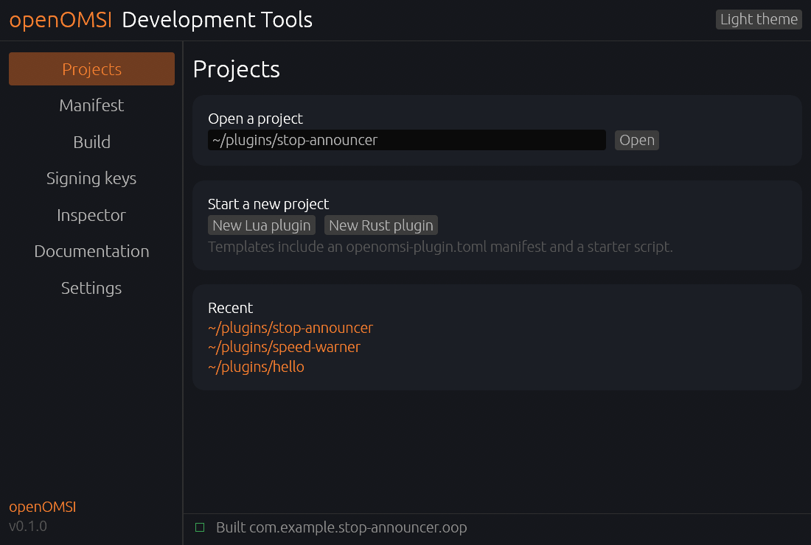
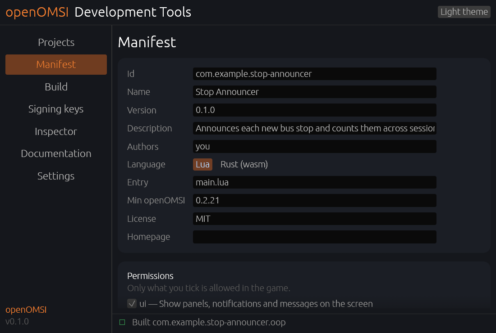
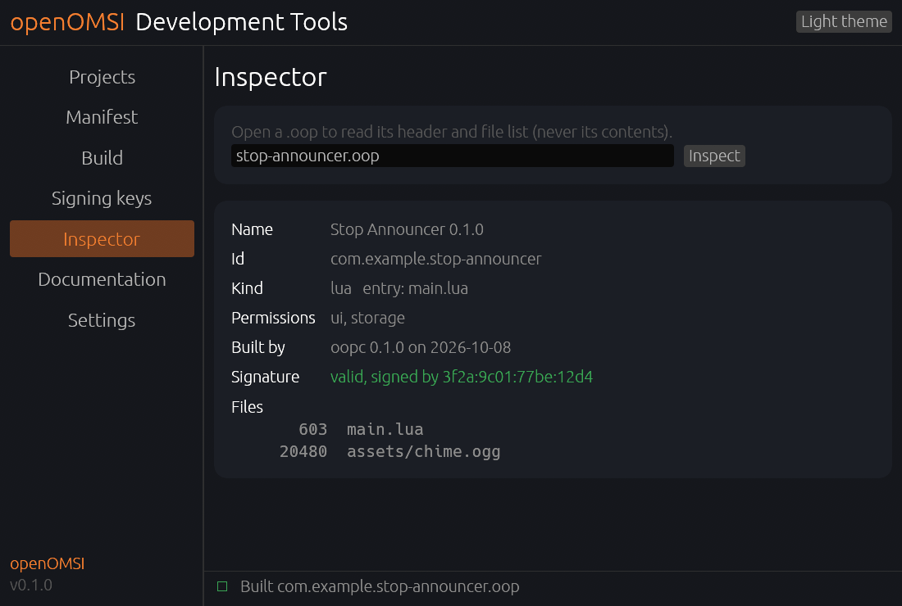

# openOMSI Development Tools

Tools for building **plugins** for [openOMSI](https://github.com/openOMSI-org/openOMSI), the
open-source recreation of the bus simulator OMSI 2. Write a plugin in Lua or Rust; these tools
compile, sign and pack it into a single `.oop` file you drop into the game's `plugins` folder.

- **`oopc`** — a cross-platform CLI: `new`, `build`, `pack`, `keygen`, `sign`, `verify`,
  `inspect`, `check`.
- **`openomsi-plugin-sdk`** — a safe, idiomatic Rust SDK for writing plugins that compile to
  WebAssembly.
- **openOMSI Development Tools** — a desktop app: project templates, a manifest editor, a Build
  page with a live log, signing-key management, a `.oop` inspector and a documentation browser.



## Quick start

```sh
oopc new hello --lua     # or --rust
cd hello
oopc build               # writes dist/com.example.hello.oop
```

Copy the `.oop` into openOMSI's `plugins` folder and start a map. Sign your builds so players see
who made them:

```sh
oopc keygen
oopc build --sign ~/.config/openOMSI-devtools/keys/my-openOMSI-key.oopkey
```

A first Lua plugin:

```lua
omsi.on("start", function()
  omsi.message("Hello from my plugin!", 5)
end)

omsi.every(1, function()
  local kmh = omsi.var("Velocity")
  if kmh and kmh > 50 then
    omsi.message(string.format("Slow down: %.0f km/h", kmh), 1)
  end
end)
```

...or in Rust:

```rust
use openomsi_plugin_sdk as omsi;

omsi::plugin!(|| {
    omsi::on_start(|| {
        let _ = omsi::api::message("Hello from my plugin!", Some(5.0));
    });
});
```

## What is a `.oop`?

A compiled, sandboxed plugin — like a DLL, but it never contains your source. Lua is run through
an obfuscating Lua-to-Lua compiler; Rust compiles to a stripped WebAssembly module. The archive is
compressed, encrypted (XChaCha20-Poly1305) and optionally signed with Ed25519. See the
[format and its honest security note](docs/oop-format.md).

## Downloads

Prebuilt `oopc` and the desktop app for Windows, Linux and macOS (x86_64 and ARM64) are on the
[releases page](https://github.com/openOMSI-org/openOMSI-Development-Tools/releases). Rust plugins
also need the Rust toolchain and `rustup target add wasm32-unknown-unknown`.

## Documentation

- [Getting started](docs/getting-started.md)
- [The `.oop` format](docs/oop-format.md)
- [CLI reference](docs/cli.md)
- [Rust SDK](docs/sdk.md)
- [Publishing and signing](docs/publishing.md)

The full documentation, with a searchable API reference, is published at
<https://openomsi-org.github.io/openOMSI-Development-Tools/>.

## The app

| Manifest editor | Inspector |
| --- | --- |
|  |  |

## Building from source

```sh
cargo build --release               # oopc, the SDK, the CLI
cargo build --release -p openomsi-devtools   # the desktop app (uses the wgpu-openomsi fork)
cargo test                          # tests
cargo xtask gen-sdk <api.json>      # regenerate the SDK's typed API from a manifest
cargo xtask gen-docs                # build the documentation site
```

## License

MIT — see [LICENSE](LICENSE).
